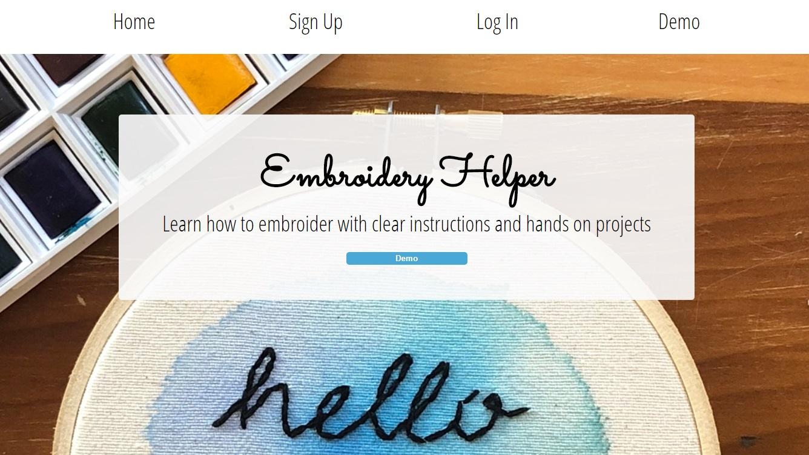
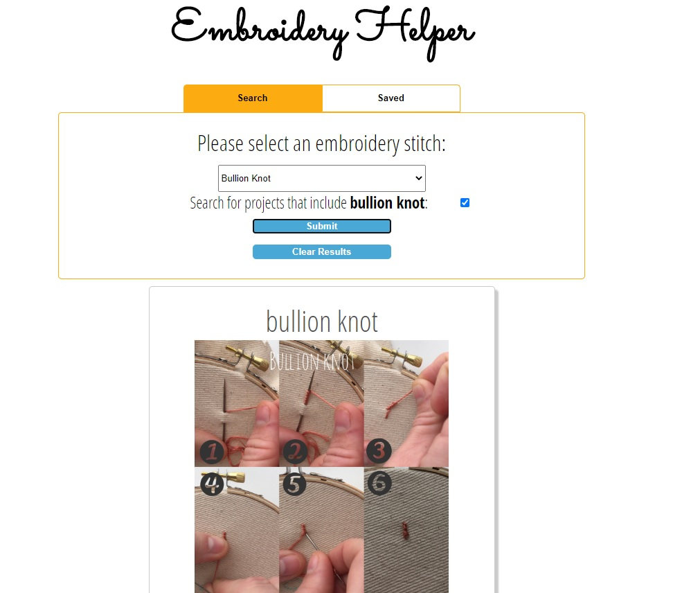
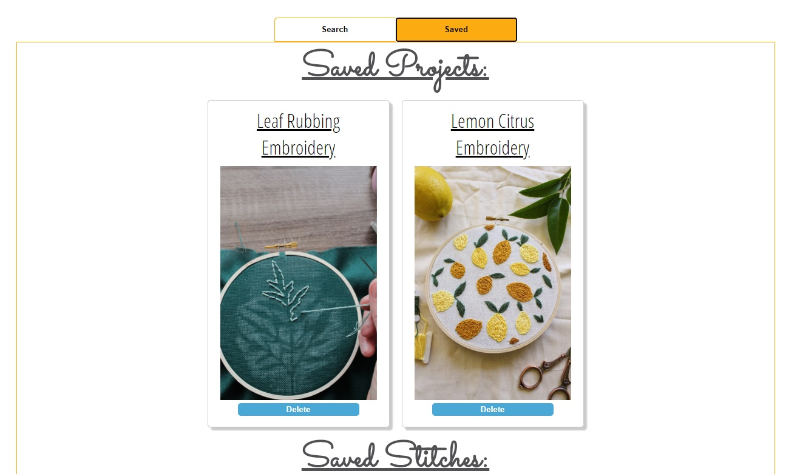

# Embroidery Helper API
REST API that has embroidery stitches and embroidery projects. 

## About
The hand embroidery api allows users to create an account, search for embroidery stitches and projects to learn, as well as save and delete embroidery stitches and projects to their account. 

## Live Link
https://embroidery-helper.now.sh/

## Technologies Used
* Javascript
* Node.js
* Express
* PostgreSQL
* RESTful API

## Screenshots

## Base URL
https://secure-woodland-74305.herokuapp.com

## Response
* JSON

## Authentication
* Requires JWT token

Each request must include  `content-type: application/json` and `Authorization: Bearer [token]`

## Create New User
* POST /api/users
* Request Body must include: username, first_name, user_password 

## Log In
* POST /api/auth/login
* Request Body must include username, user_password

## Stitches

### GET stitches
* /api/stitches to get all stitches
* /api/stitches/:id to get a stitch by it's id
* optional query to find specific stitch: `stitch=[text]`

### GET projects 
* /api/projects to get all projects
* /api/projects/:id to get a project by id
* optional query to find specific project by stitches they require: `stitch=[text]`

## User's Saved Stitches

### GET user's saved stitches
* /api/saved_stitches to get all saved stitches

### GET saved stitch by id
* /api/saved_stitches/:id

### DELETE user's saved stitch
* /api/saved_stitches/:id

### POST save a stitch to user
* /api/saved_stitches/:id

## User's Saved Projects 

### GET user's saved projects
* /api/saved_projects to get all saved projects

### GET user's saved project by id
* /api/saved_projects/:id

### DELETE user's saved project
* /api/saved_projects/:id

### POST save a project to user
* /api/saved_projects/:id
